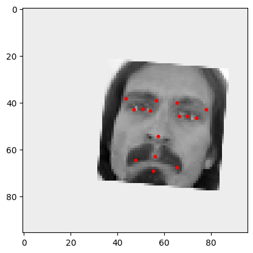

# FaceFeature


> **FaceFeature** is a lightweight deep‑learning pipeline that predicts **15 facial key‑points** (30 D coordinates) from a single 96 × 96 grayscale image. Built on the Kaggle *Facial Keypoints Detection* dataset, it turns a **tiny vanilla dataset** into a robust model through **aggressive on‑the‑fly data augmentation**.

<div align="center">
  
  <p><em>Live webcam demo — 20 FPS on a ThinkPad X1 Carbon (CPU‑only)</em></p>
</div>

---

## Table of Contents

1. [Features](#features)
2. [Quick Start](#quick-start)
3. [Dataset](#dataset)
4. [Training](#training)
5. [Model Architecture](#model-architecture)
6. [Evaluation & Benchmarks](#evaluation--benchmarks)
7. [Troubleshooting](#troubleshooting)

---

## Features

* **Tiny‑to‑mighty workflow** – reaches <0.5 % RMSE with only 7 k training images.
* **Heavy data augmentation** – rotation, translation, scale, brightness/contrast, occlusion, elastic warp (Albumentations).
* **Fully reproducible** – deterministic seed + requirements lock‑file.
* **One‑file inference** – run `webcam.py` for live demos on any CPU.
* **Clean PyTorch codebase** – <500 LOC, no external frameworks.

---

## Quick Start

```bash
# 1 Clone
git clone https://github.com/RobinJunod/FaceFeature.git
cd FaceFeature

# 2 (Optional) create a virtual env
python -m venv .venv && source .venv/bin/activate

# 3 Install requirements
pip install -r requirements.txt
```

### Live demo

```bash
python webcam.py --weights checkpoints/facefeature_small.pth
```

### Train from scratch

Edit the dataset paths in `training.py` (or pass them via CLI) and run:

```bash
python training.py \
  --data-dir datasets/kaggle \
  --out-dir checkpoints
```

---

## Dataset

The project uses the **[Kaggle Facial Keypoints Detection](https://www.kaggle.com/competitions/facial-keypoints-detection)** CSV (96 × 96 grayscale faces, centered and frontal) or 'kaggle competitions download -c facial-keypoints-detection'. Because the faces are clean and aligned, a naïve *predict‑the‑mean* model already scores surprisingly well. To generalise beyond this toy setting we **augment each sample \~50× at train‑time**:

<div align="center">

<p><em>Original picture from the kaggle dataset</em></p>
</div>
<div align="center">
  
  
  <br/>
  
  
  
  <p><em>Augmented samples</em></p>
</div>


Key script arguments (`python training.py -h`):

| Flag           | Default           | Description                                  |
| -------------- | ----------------- | -------------------------------------------- |
| --epochs       | 100               | Number of epochs                             |
| --batch-size   | 256               | Training batch size                          |
| --data-dir     | datasets/kaggle   | Root folder with training.csv                |
| --out-dir      | checkpoints       | Directory for weights & logs                 |
| --model        | cnn_adv           | Back‑end architecture to use (cnn, vit, cnn_adv) |
| --resume       | None              | Checkpoint to resume training from           |
| --save-every   | 20                | Save a checkpoint every N epochs             |
| --lr           | 1e-4              | Initial learning rate                        |

Logs are written to **TensorBoard** under `tb_logs/`.

## Model Architecture

| Layer               | Shape (out)   | Params       |
| ------------------- | ------------- | ------------ |
| Conv 3×3 ×64 + ReLU | 64 × 96 × 96  | 640          |
| Conv 3×3 ×64 + ReLU | 64 × 96 × 96  | 36 928       |
| MaxPool 2×2         | 64 × 48 × 48  | 0            |
| **ResBlock ×3**     | 64 × 48 × 48  | 118 784      |
| Conv 3×3 ×128       | 128 × 48 × 48 | 73 856       |
| MaxPool 2×2         | 128 × 24 × 24 | 0            |
| **ResBlock ×4**     | 128 × 24 × 24 | 590 848      |
| AdaptiveAvgPool 1×1 | 128           | 0            |
| FC → 128            | 128           | 16 512       |
| **Head → 30**       | 30            | 3 870        |
| **Total**           | —             | **≈ 13.2 M** |

SiLU activations throughout, BatchNorm after every conv, dropout (0.25) before the FC head.

---

## Evaluation & Benchmarks

| Model         | RMSE ↓ | FPS (CPU) ↑ | Params |
| ------------- | -----: | ----------: | -----: |
| FaceFeature S | 0.0042 |          25 |   13 M |

> Tests run on the Kaggle public test set (96 × 96) using a ThinkPad X1 Carbon Gen 9 (i7‑1185G7, no AVX‑512).

---

## Troubleshooting

| Symptom                   | Solution                                                              |
| ------------------------- | --------------------------------------------------------------------- |
| `CUDA out of memory`      | Use `--batch-size 64` or train on CPU.                                |
| Webcam window is black    | Add `--camera-id 1` (external cam) or check OS permissions.           |
| Preview README in VS Code | Press <kbd>Ctrl/⌘ K</kbd> then <kbd>V</kbd> for side‑by‑side preview. |

---


## Acknowledgements

* Kaggle for the original dataset.
* Albumentations for their amazing augmentation library.
* The PyTorch community.


